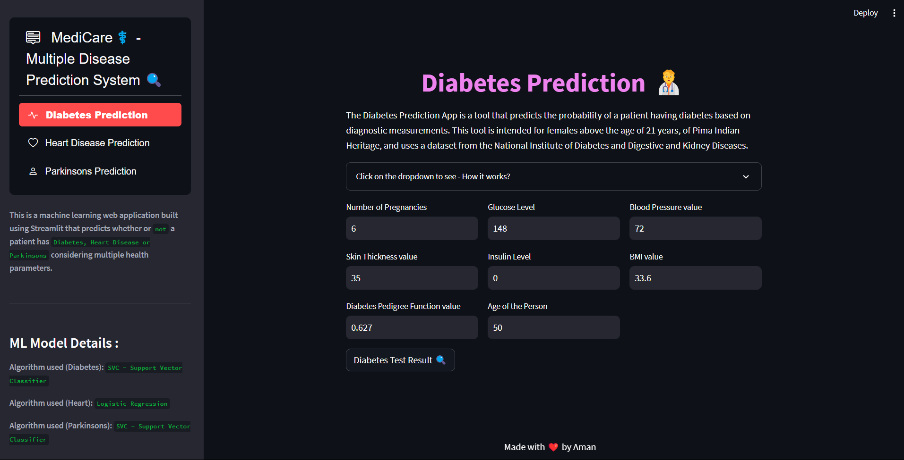

<div align='center'>
  

  <h1>MediCare - A Multiple Disease Prediction System
 🧑‍⚕️</h1>



  <p>
A machine learning web application built using Streamlit that predicts whether or not a patient has Diabetes, Heart Disease or Parkinsons considering multiple health parameters.
  </p>
  
 
 <h4>
    <a href="https://diabetes-prediction-app-v1.streamlit.app/">View Demo</a>
  <span> · </span>
    <a href="https://github.com/aman-chhetri/MediCare/blob/main/README.md">Documentation</a>
  <span> · </span>
    <a href="https://github.com/aman-chhetri/MediCare/issues">Report Bug</a>
  </h4>
</div>


<!-- Table of Contents -->

## 📔 Table of Contents

- [Dataset](#📶-dataset)
- [Dependencies](#🧰-dependencies)
- [Installation](#⚙️-installation)
- [Usage](#⏯️-usage)
- [Deployment and Notebook](#🚩-deployment-and-notebook)
- [Contact](#📩-contact)


<!-- ## 📶 Dataset

The trained dataset is originally from the `National Institute of Diabetes and Digestive and Kidney Diseases`. The objective is to predict based on diagnostic measurements whether a patient has diabetes. Several constraints were placed on the selection of these instances from a larger database. In particular, all patients here are `females` at least `21 years` old of `Pima Indian heritage`. The dataset can be found on [`Kaggle`](https://www.kaggle.com/datasets/uciml/pima-indians-diabetes-database). It includes following health criteria:

- Pregnancies: Number of times pregnant
- Glucose: Plasma glucose concentration a 2 hours in an oral glucose tolerance test
- BloodPressure: Diastolic blood pressure (mm Hg)
- SkinThickness: Triceps skin fold thickness (mm)
- Insulin: 2-Hour serum insulin (mu U/ml)
- BMI: Body mass index (weight in kg/(height in m)^2)
- DiabetesPedigreeFunction: Diabetes pedigree function
- Age: Age (years)
- Outcome: Class variable (0 or 1) -->


## 🧰 Dependencies

`streamlit` `scikit-learn`

`numpy` `pandas`  `matplotlib` `seaborn` 


## ⚙️ Installation

Clone the repository and install the required dependencies using the following commands:

```bash
git clone https://github.com/aman-chhetri/MediCare.git
```

```bash
cd MediCare
```

```bash
pip install -r requirements.txt
```

```bash
streamlit run app.py
```

## ⏯️ Usage

1. Open the app in your web browser.
2. Enter the required information in the input fields.
3. Click the `Test Result` button to generate the prediction.


## 🚩 Deployment and Notebook

This tool has been deployed using [`Streamlit`](https://streamlit.io/). Learn about streamlit deployment [`here`](https://docs.streamlit.io/streamlit-community-cloud/get-started/deploy-an-app). Checkout the notebook repository [`here`](https://github.com/aman-chhetri/MediCare) from where the pickle file has been imployed in the tool.

## 📩 Contact 

If you have any questions or feedback, feel free to reach out 🙂

- Email: chhetryaman3@gmail.com
- LinkedIn : [@amankshetri](https://www.linkedin.com/in/amankshetri/)
- Twitter : [@iamamanchhetri](https://twitter.com/iamamanchhetri)


<div align="center">© 2024 Aman Kshetri 👨‍💻</div>